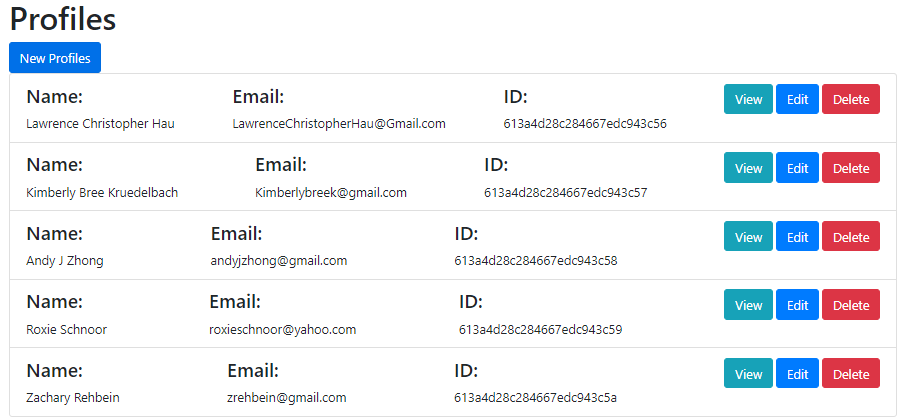
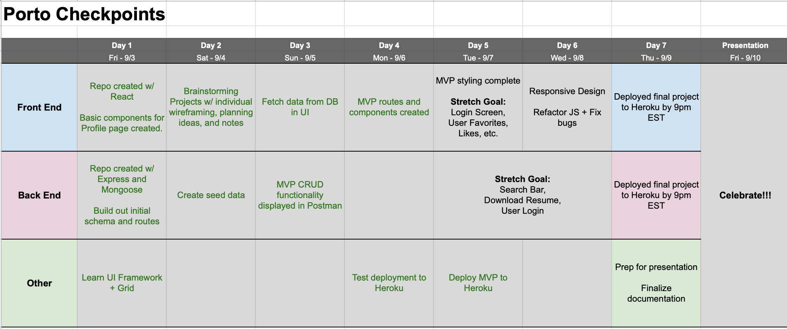
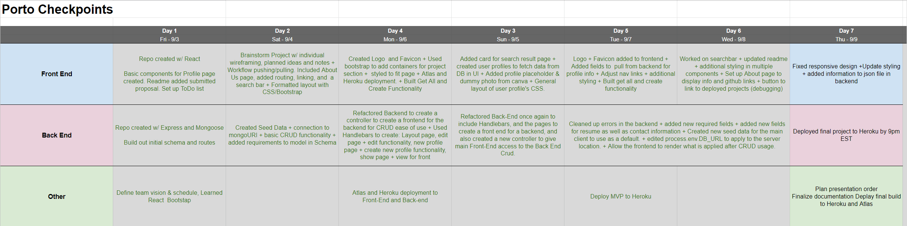
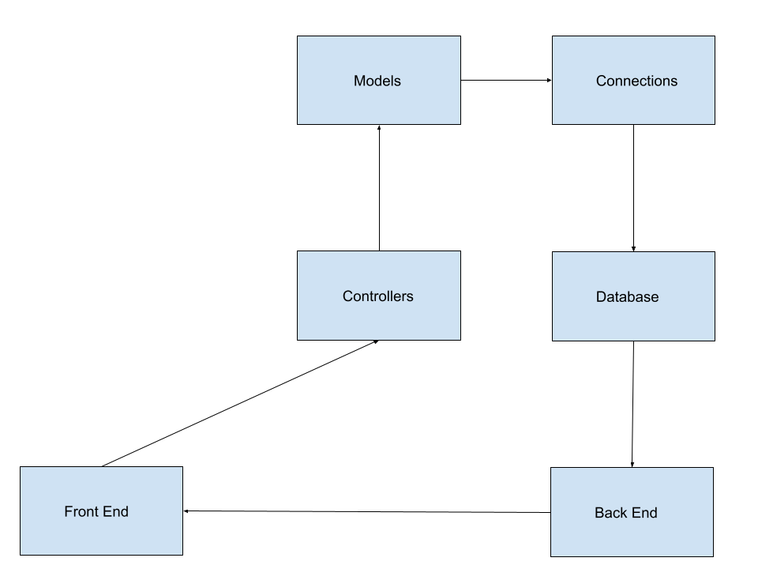
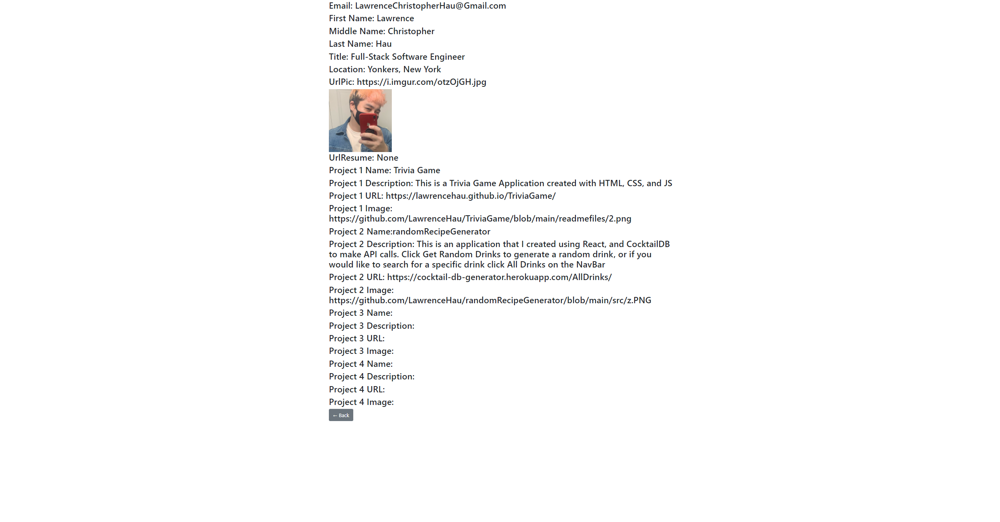
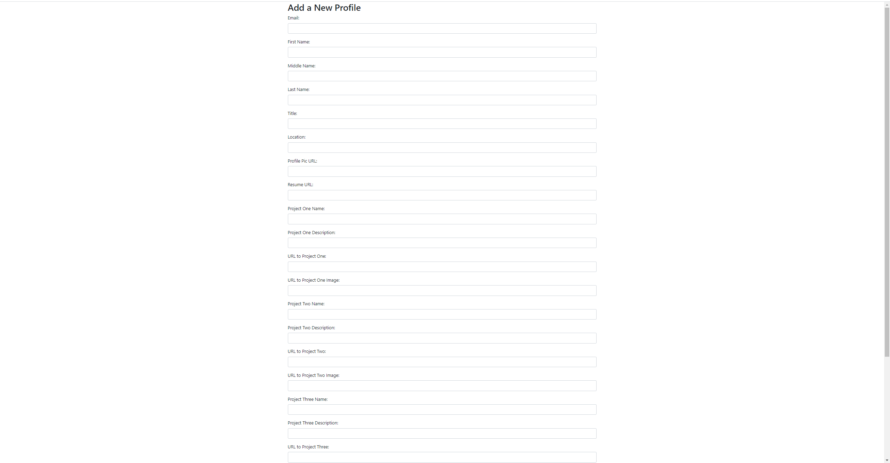

# Porto Server

**Creators**
-   Andy Zhong
-   Kimberly Kruedelbach
-   Zak Rehbein
-   Lawrence Hau
-   Roxie Schnoor

### Technology Used
-   **cors**
-   **express**
-   **handlebars**
-   **method-override**
-   **mongoose@5.13.8**
-   **nodemon**

### Install Instructions

- Fork and Clone this repository, along with the porto-server to provide the backend data.

In your terminal after cloning, run:

**`npm install`** or **`npm i`**
**`npm run start`** or **`npm start`**

### Features

- Creates DB Entries.
- Reads DB Entries
- Updates DB Entries.
- Deletes DB Entries.
- Dedicated Front-End page built for Back-End server management

### Approach

We needed to create a back end database for our application, in order to do that we had to understand the utility necessary for the back end to provide for the front-end. We decided that each user will have a profile, the profile includes, a mandatory first name, last name, image url for profile picture, job title, location, email, and url to resume, as well as an optional middle name field, after completing those required fields, each user will be able to have up to four projects in their profile which includes a project url, a project description, a project name, and an image url to show your project.

## Planning

**Expectations for planning**

**Results**

## Structuring of Components

## Results

**Index For Back-End**

**Views for Back-End**

**Create a New Profile for Back-End**

**Edit a Profile for Back-End**

